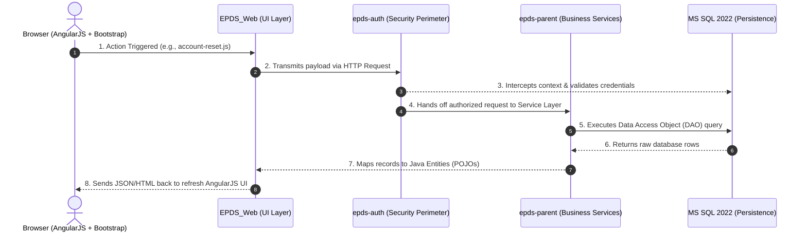

# EPDS Architectural Walkthrough: From Frontend UI to MS SQL 2022

This guide maps out the end-to-end technical pipeline of the Enterprise Project Delivery System (EPDS). It traces how a user action on the frontend traverses security layers, executes business rules, and interfaces with Microsoft SQL Server 2022.

---

## 🗺️ System Request Lifecycle



---

## 🚪 Phase 1: The UI & Client Entry Point (`EPDS_Web`)

1. **User Interface Framework**: The presentation tier is isolated inside **`EPDS_Web`**, utilizing **AngularJS** backed by **UI Bootstrap** styles.
2. **Client-Side Orchestration**: Script controllers (such as `account-reset.js`) listen for user browser events, capture text input payloads, and handle asynchronous AJAX network communication (`$http`).
3. **Servlet Routing Context**: The application maps incoming uniform resource identifiers (URIs) to backend handler mappings via standard enterprise deployment contexts (`web.xml`).

---

## 🔐 Phase 2: The Security Perimeter (`epds-auth`)

Before any inbound web request is allowed to interact with the underlying database or core enterprise beans, it must pass inspection within the security perimeter.

1. **Request Interception**: The isolated **`epds-auth`** module functions as a gatekeeper filtering incoming requests.
2. **Identity Verification**: The security engine references specialized database authorization tables inside **MS SQL Server 2022** to cross-examine security credentials.
3. **Session State**: Validated sessions are bound to the underlying **JBoss/WildFly 23** runtime context, assigning identity roles that dictate downstream component access.

---

## ⚙️ Phase 3: Core Service & Persistence (`epds-parent`)

Once a request safely passes authorization, business logic executes inside managed transactional boundaries.

### 📦 Enterprise Business Logic
* Application logic runs inside the **`epds-parent`** module.
* Services orchestrate multi-step database processes using standard enterprise patterns, leveraging the `@Transactional` wrapper to guarantee atomic data commitments.

### 💾 Database Connectivity to MS SQL 2022
* **Persistence Configuration**: The system defines data sources, connection pooling properties, and object-relational mapping settings within `epds-parent/.../persistence-units.xml`.
* **Data Access Objects (DAO)**: Your DAOs (like `Account_status_dao.java`) isolate raw database querying by expanding the foundational `DataAccess` utility:

```java
@Repository
public class Account_status_dao extends DataAccess {
    
    @Transactional
    public List<Account_status> getListOfAccount_status() {
        // Core Object-Oriented Query
        String query = "from ACCOUNT_STATUS";
        Map<String, Object> map = new HashMap<String, Object>();
        
        // Dispatches the transaction down the JBoss JNDI connection pool
        List<?> resultList = queryWithParams(query, map);
        
        if (resultList != null && resultList.size() > 0) {
            return (List<Account_status>) resultList;
        }
        return null;
    }
}
```

### 🔁 Data Sync & Visual Delivery
1. The framework translates object queries (`from ACCOUNT_STATUS`) down into native Transact-SQL syntax optimized for the **MS SQL Server 2022** dialect engine.
2. The query evaluates over port `1433`.
3. Tabular results are mapped back into standard Java Objects (`Account_status`) and bubbled up to the web layer to dynamically refresh the active AngularJS user view.

---

## 🧪 Phase 4: Unit & Integration Testing (`Account_status_dao`)

Testing components that inherit from a custom `DataAccess` wrapper requires setting up an isolated test environment. We use **JUnit 4/5** paired with **Mockito** (to mock dependencies) or an **In-Memory H2 Database** configured to run in a compatibility mode for **MS SQL Server 2022**.

### 📋 Test Blueprint: `Account_status_daoTest.java`

Create this test class under your test directories: `epds-parent/src/test/java/gov/gao/epds/auth/persistence/Account_status_daoTest.java`.

```java
package gov.gao.epds.auth.persistence;

import static org.junit.Assert.*;
import static org.mockito.Mockito.*;

import java.util.ArrayList;
import java.util.List;
import org.junit.Before;
import org.junit.Test;
import org.junit.runner.RunWith;
import org.mockito.InjectMocks;
import org.mockito.Mock;
import org.mockito.MockitoAnnotations;
import org.mockito.runners.MockitoJUnitRunner;

@RunWith(MockitoJUnitRunner.class)
public class Account_status_daoTest {

    // 1. Inject the class under test
    @InjectMocks
    private Account_status_dao accountStatusDao;

    // 2. Mock the parent DataAccess query runner execution if avoiding a live database
    @Mock
    private DataAccess dataAccessMock;

    @Before
    public void setUp() {
        MockitoAnnotations.initMocks(this);
    }

    /**
     * Test Case: Verifies that when records exist in MS SQL, 
     * they are properly typed, hydrated, and returned.
     */
    @Test
    public void testGetListOfAccount_status_ReturnsData() {
        // Arrange: Prepare dummy database entities matching your schema
        List<Object> mockResults = new ArrayList<>();
        Account_status status1 = new Account_status();
        status1.setStatusId(1);
        status1.setStatusName("ACTIVE");
        mockResults.add(status1);

        // Spy or Mock the internal framework call "queryWithParams" inherited from DataAccess
        Account_status_dao daoSpy = spy(accountStatusDao);
        doReturn(mockResults).when(daoSpy).queryWithParams(eq("from ACCOUNT_STATUS"), anyMap());

        // Act: Execute the method under test
        List<Account_status> actualList = daoSpy.getListOfAccount_status();

        // Assert: Confirm the behavior matches structural expectations
        assertNotNull("The returned account status list should not be null", actualList);
        assertEquals("Should contain exactly 1 status entry", 1, actualList.size());
        assertEquals("ACTIVE", actualList.get(0).getStatusName());
    }

    /**
     * Test Case: Validates null-safety routines when no rows are found in MS SQL.
     */
    @Test
    public void testGetListOfAccount_status_ReturnsNullWhenEmpty() {
        // Arrange: Simulate an empty result list from the query context
        Account_status_dao daoSpy = spy(accountStatusDao);
        doReturn(new ArrayList<>()).when(daoSpy).queryWithParams(eq("from ACCOUNT_STATUS"), anyMap());

        // Act
        List<Account_status> actualList = daoSpy.getListOfAccount_status();

        // Assert
        assertNull("The DAO must safely yield null if the database contains zero matching entries", actualList);
    }
}
```

### 🔬 3-Step Execution & Lifecycle Breakdown

When this pipeline runs locally or during a CI/CD build cycle, it goes through three distinct stages:

#### 1. Lifecycle Phase: Arrange
* The `@RunWith(MockitoJUnitRunner.class)` statement triggers initialization routines before any tests execute.
* `@InjectMocks` prepares an instance of your `Account_status_dao`.
* Mock collections mimic raw database table states without opening an active thread to your production MS SQL Server 2022 deployment.

#### 2. Lifecycle Phase: Act
* The code invokes `daoSpy.getListOfAccount_status()`.
* The method triggers the HQL context engine and intercepts the execution pattern at your custom implementation boundary inside `queryWithParams`.

#### 3. Lifecycle Phase: Assert
* Defensive evaluation asserts verify that internal collection lengths match perfectly (`assertEquals`).
* Null-safety tests run to confirm that empty result returns will not cause a `NullPointerException` (NPE) elsewhere in your application.

---

### ⚙️ Executing the Test in Your Workspace

You can run this test suite directly from your IDE or by using your terminal commands:

* **Using the IDE GUI:** Open `Account_status_daoTest.java`, hover your cursor near line 16, and click the **Green Play Arrow** icon next to the class name.
* **Using the Command Line Root Terminal:** Run the standard Maven testing phase command:
  ```bash
  mvn clean test -Dtest=Account_status_daoTest
  ```


---

## 🚀 Phase 5: WildFly 23.0.2.Final Deployment Configuration

The EPDS project is packaged as an Enterprise Archive (`.ear`) containing `epds-auth.jar`, `epds-parent.jar`, and `EPDS_Web.war`. It runs inside a **WildFly 23.0.2.Final-redhat-00001** application server container environment.

### 📁 1. Module Packaging Structure
WildFly isolates application dependencies using a modular classloader layout. The enterprise bundle must deploy utilizing the following component hierarchies:

