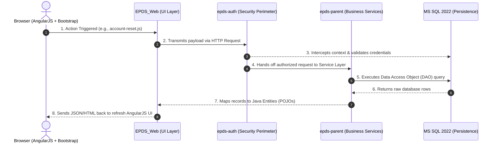

# EPDS Architectural Walkthrough: From Frontend UI to MS SQL 2022

This guide maps out the end-to-end technical pipeline of the Enterprise Project Delivery System (EPDS). It traces how a user action on the frontend traverses security layers, executes business rules, and interfaces with Microsoft SQL Server 2022.

---

## 🗺️ System Request Lifecycle



---

## 🚪 Phase 1: The UI & Client Entry Point (`EPDS_Web`)

1. **User Interface Framework**: The presentation tier is isolated inside **`EPDS_Web`**, utilizing **AngularJS** backed by **UI Bootstrap** styles.
2. **Client-Side Orchestration**: Script controllers (such as `account-reset.js`) listen for user browser events, capture text input payloads, and handle asynchronous AJAX network communication (`$http`).
3. **Servlet Routing Context**: The application maps incoming uniform resource identifiers (URIs) to backend handler mappings via standard enterprise deployment contexts (`web.xml`).

---

## 🔐 Phase 2: The Security Perimeter (`epds-auth`)

Before any inbound web request is allowed to interact with the underlying database or core enterprise beans, it must pass inspection within the security perimeter.

1. **Request Interception**: The isolated **`epds-auth`** module functions as a gatekeeper filtering incoming requests.
2. **Identity Verification**: The security engine references specialized database authorization tables inside **MS SQL Server 2022** to cross-examine security credentials.
3. **Session State**: Validated sessions are bound to the underlying **JBoss/WildFly 23** runtime context, assigning identity roles that dictate downstream component access.

---

## ⚙️ Phase 3: Core Service & Persistence (`epds-parent`)

Once a request safely passes authorization, business logic executes inside managed transactional boundaries.

### 📦 Enterprise Business Logic
* Application logic runs inside the **`epds-parent`** module.
* Services orchestrate multi-step database processes using standard enterprise patterns, leveraging the `@Transactional` wrapper to guarantee atomic data commitments.

### 💾 Database Connectivity to MS SQL 2022
* **Persistence Configuration**: The system defines data sources, connection pooling properties, and object-relational mapping settings within `epds-parent/.../persistence-units.xml`.
* **Data Access Objects (DAO)**: Your DAOs (like `Account_status_dao.java`) isolate raw database querying by expanding the foundational `DataAccess` utility:

```java
@Repository
public class Account_status_dao extends DataAccess {
    
    @Transactional
    public List<Account_status> getListOfAccount_status() {
        // Core Object-Oriented Query
        String query = "from ACCOUNT_STATUS";
        Map<String, Object> map = new HashMap<String, Object>();
        
        // Dispatches the transaction down the JBoss JNDI connection pool
        List<?> resultList = queryWithParams(query, map);
        
        if (resultList != null && resultList.size() > 0) {
            return (List<Account_status>) resultList;
        }
        return null;
    }
}
```

### 🔁 Data Sync & Visual Delivery
1. The framework translates object queries (`from ACCOUNT_STATUS`) down into native Transact-SQL syntax optimized for the **MS SQL Server 2022** dialect engine.
2. The query evaluates over port `1433`.
3. Tabular results are mapped back into standard Java Objects (`Account_status`) and bubbled up to the web layer to dynamically refresh the active AngularJS user view.

---

## 🧪 Phase 4: Unit & Integration Testing (`Account_status_dao`)

Testing components that inherit from a custom `DataAccess` wrapper requires setting up an isolated test environment. We use **JUnit 4/5** paired with **Mockito** (to mock dependencies) or an **In-Memory H2 Database** configured to run in a compatibility mode for **MS SQL Server 2022**.

### 📋 Test Blueprint: `Account_status_daoTest.java`

Create this test class under your test directories: `epds-parent/src/test/java/gov/gao/epds/auth/persistence/Account_status_daoTest.java`.

```java
package gov.gao.epds.auth.persistence;

import static org.junit.Assert.*;
import static org.mockito.Mockito.*;

import java.util.ArrayList;
import java.util.List;
import org.junit.Before;
import org.junit.Test;
import org.junit.runner.RunWith;
import org.mockito.InjectMocks;
import org.mockito.Mock;
import org.mockito.MockitoAnnotations;
import org.mockito.runners.MockitoJUnitRunner;

@RunWith(MockitoJUnitRunner.class)
public class Account_status_daoTest {

    // 1. Inject the class under test
    @InjectMocks
    private Account_status_dao accountStatusDao;

    // 2. Mock the parent DataAccess query runner execution if avoiding a live database
    @Mock
    private DataAccess dataAccessMock;

    @Before
    public void setUp() {
        MockitoAnnotations.initMocks(this);
    }

    /**
     * Test Case: Verifies that when records exist in MS SQL, 
     * they are properly typed, hydrated, and returned.
     */
    @Test
    public void testGetListOfAccount_status_ReturnsData() {
        // Arrange: Prepare dummy database entities matching your schema
        List<Object> mockResults = new ArrayList<>();
        Account_status status1 = new Account_status();
        status1.setStatusId(1);
        status1.setStatusName("ACTIVE");
        mockResults.add(status1);

        // Spy or Mock the internal framework call "queryWithParams" inherited from DataAccess
        Account_status_dao daoSpy = spy(accountStatusDao);
        doReturn(mockResults).when(daoSpy).queryWithParams(eq("from ACCOUNT_STATUS"), anyMap());

        // Act: Execute the method under test
        List<Account_status> actualList = daoSpy.getListOfAccount_status();

        // Assert: Confirm the behavior matches structural expectations
        assertNotNull("The returned account status list should not be null", actualList);
        assertEquals("Should contain exactly 1 status entry", 1, actualList.size());
        assertEquals("ACTIVE", actualList.get(0).getStatusName());
    }

    /**
     * Test Case: Validates null-safety routines when no rows are found in MS SQL.
     */
    @Test
    public void testGetListOfAccount_status_ReturnsNullWhenEmpty() {
        // Arrange: Simulate an empty result list from the query context
        Account_status_dao daoSpy = spy(accountStatusDao);
        doReturn(new ArrayList<>()).when(daoSpy).queryWithParams(eq("from ACCOUNT_STATUS"), anyMap());

        // Act
        List<Account_status> actualList = daoSpy.getListOfAccount_status();

        // Assert
        assertNull("The DAO must safely yield null if the database contains zero matching entries", actualList);
    }
}
```

### 🔬 3-Step Execution & Lifecycle Breakdown

When this pipeline runs locally or during a CI/CD build cycle, it goes through three distinct stages:

#### 1. Lifecycle Phase: Arrange
* The `@RunWith(MockitoJUnitRunner.class)` statement triggers initialization routines before any tests execute.
* `@InjectMocks` prepares an instance of your `Account_status_dao`.
* Mock collections mimic raw database table states without opening an active thread to your production MS SQL Server 2022 deployment.

#### 2. Lifecycle Phase: Act
* The code invokes `daoSpy.getListOfAccount_status()`.
* The method triggers the HQL context engine and intercepts the execution pattern at your custom implementation boundary inside `queryWithParams`.

#### 3. Lifecycle Phase: Assert
* Defensive evaluation asserts verify that internal collection lengths match perfectly (`assertEquals`).
* Null-safety tests run to confirm that empty result returns will not cause a `NullPointerException` (NPE) elsewhere in your application.

---

### ⚙️ Executing the Test in Your Workspace

You can run this test suite directly from your IDE or by using your terminal commands:

* **Using the IDE GUI:** Open `Account_status_daoTest.java`, hover your cursor near line 16, and click the **Green Play Arrow** icon next to the class name.
* **Using the Command Line Root Terminal:** Run the standard Maven testing phase command:
  ```bash
  mvn clean test -Dtest=Account_status_daoTest
  ```


---

## 🚀 Phase 5: WildFly 23.0.2.Final Deployment Configuration

The EPDS project is packaged as an Enterprise Archive (`.ear`) containing `epds-auth.jar`, `epds-parent.jar`, and `EPDS_Web.war`. It runs inside a **WildFly 23.0.2.Final-redhat-00001** application server container environment.

### 📁 1. Module Packaging Structure
WildFly isolates application dependencies using a modular classloader layout. The enterprise bundle must deploy utilizing the following component hierarchies:

---

## 🔄 Phase 6: Enterprise Transaction Lifecycle & Rollback Mechanics

The EPDS application relies on **Container-Managed Transactions (CMT)** orchestrated by the JBoss/WildFly application server's transaction manager (Arjuna/Narayana JTA) and abstraction components within the Spring Framework. This section outlines the structural pathways for how transactions are initialized, propagated, and rolled back.

### 🗺️ Transaction Flow Architecture

```mermaid
sequenceDiagram
    autonumber
    actor Web as EPDS_Web / Controller
    participant Prox as Spring AOP Proxy Context
    participant TM as WildFly JTA Transaction Manager
    participant DAO as Account_status_dao
    participant DB as MS SQL 2022

    Web->>Prox: 1. Invokes method annotated with @Transactional
    Prox->>TM: 2. Intercepts call; interceptor requests Transaction start
    TM->>DB: 3. Issues 'BEGIN TRANSACTION' over active JDBC connection
    Prox->>DAO: 4. Delegates call to physical DAO method execution
    DAO->>DB: 5. Executes HQL/SQL statements inside thread context
    alt Success Path
        DAO-->>Prox: 6a. Method exits normally (no unhandled Exceptions)
        Prox->>TM: 7a. Interceptor requests execution completion
        TM->>DB: 8a. Issues 'COMMIT' (Changes finalized to disk)
    else Failure Path (RuntimeException Thrown)
        DAO-->>Prox: 6b. Throws unhandled Exception up the execution stack
        Prox->>TM: 7b. Interceptor catches error; flags transaction as rollback-only
        TM->>DB: 8b. Issues 'ROLLBACK' (All uncommitted data changes wiped clean)
    end
```

---

### 1. Transaction Initialization (The Boundary)

When a service bean or DAO method is flagged with the `@Transactional` annotation (as seen in your `Account_status_dao.java`), Spring utilizes **Aspect-Oriented Programming (AOP) Proxies** to wrap the execution:

```java
@Repository
public class Account_status_dao extends DataAccess {
    
    @Transactional // <--- Directs the proxy engine to manage database boundaries
    public List<Account_status> getListOfAccount_status() {
        String query = "from ACCOUNT_STATUS";
        Map<String, Object> map = new HashMap<String, Object>();
        
        // Statements executed here pass down an active, shared transaction context
        List<?> resultList = queryWithParams(query, map);
        
        if (resultList != null && resultList.size() > 0) {
            return (List<Account_status>) resultList;
        }
        return null;
    }
}
```

* **The Proxy Interception:** When another component invokes `getListOfAccount_status()`, it doesn't call your class directly. It calls an automatically generated proxy object.
* **The Context Association:** The proxy asks the JTA Transaction Manager if an active database transaction is already bound to the running thread.
* **The Propagation Default:** By default, it uses `REQUIRED`. If a transaction exists, it joins it. If none exists, it signals the JTA provider to issue an explicit `BEGIN TRANSACTION` instruction down to **MS SQL Server 2022**.

---

### 2. Execution and Resource Locking

While your queries run within the bounds of an open transaction block:
* All database interactions inherit the server's default **Isolation Level** (typically `READ_COMMITTED` for MS SQL Server).
* Modified rows, inserts, or specific structural updates are granted local locks within the database engine.
* These alterations remain invisible to concurrent user threads accessing the system until an explicit completion instruction occurs.

---

### 3. Automated Rollback Mechanisms

The system relies on automatic interception rules to determine whether data changes should be safely discarded.

* **Triggered by Unchecked Exceptions:** By default, if a method wrapped in `@Transactional` throws a `RuntimeException` or an `Error` (such as a `NullPointerException` or a structural database constraint failure) that isn't explicitly caught inside a `try-catch` block, the proxy interceptor catches it.
* **The Rollback Flag:** The interceptor immediately signals the Transaction Manager by setting the execution state to **`setRollbackOnly()`**.
* **Database Restoration:** Before terminating the thread, WildFly issues a native T-SQL `ROLLBACK TRANSACTION` instruction over port 1433. MS SQL Server discards all temporary execution buffers, leaving table states exactly as they were before the boundary was pierced.

#### ⚠️ Critical Caveat: Checked Exceptions
Standard Java checked exceptions (extending `java.lang.Exception`, such as an `IOException`) do **not** trigger an automatic rollback by default. If your application logic requires rolling back on a checked exception, the annotation configuration boundary must be explicitly customized:

```java
// Forces rollback execution on custom checked application errors
@Transactional(rollbackFor = MyCustomCheckedException.class)
```

---

### 4. The Completion Path (Commit)

If the active DAO method runs to completion and exits via a `return` statement without dropping an unhandled error:
1. The wrapping AOP proxy intercepts the successful exit condition.
2. It requests the Transaction Manager to finalize the database operation block.
3. WildFly dispatches a definitive T-SQL `COMMIT` message to the database server.
4. **MS SQL Server 2022** releases all internal execution table locks and flushes the staging logs permanently to disk storage, making the data visible across the entire platform.


---

## 🐋 Phase 7: Docker Containerization Profile

To ensure environment consistency across development, staging, and production environments, the EPDS application uses Docker to containerize the **WildFly 23.0.2.Final** server runtime.

### 📝 1. The Deployment `Dockerfile`
Create a file named `Dockerfile` at your project root directory:

```dockerfile
# Use the official Red Hat JBoss WildFly image matching your runtime profile
FROM quay.io/wildfly/wildfly:23.0.2.Final

# Set maintenance environment parameters
ENV LAUNCH_JBOSS_IN_BACKGROUND=true
ENV JBOSS_HOME=/opt/jboss/wildfly

# 1. Copy the custom Microsoft SQL Server driver module into the server structure
COPY --chown=jboss:root modules/ /opt/jboss/wildfly/modules/

# 2. Copy the standalone server configuration containing the MS SQL Datasource profile
COPY --chown=jboss:root standalone.xml /opt/jboss/wildfly/standalone/configuration/

# 3. Copy the compiled enterprise deployment archive (.ear) to the server auto-deploy path
COPY --chown=jboss:root target/epds.ear /opt/jboss/wildfly/standalone/deployments/

# Expose HTTP (8080) and Management Console (9990) access ports
EXPOSE 8080 9990

# Set default execution command
CMD ["/opt/jboss/wildfly/bin/standalone.sh", "-b", "0.0.0.0", "-bmanagement", "0.0.0.0"]
```

### 🧬 2. Multi-Container Orchestration (`docker-compose.yml`)
To orchestrate your application container side-by-side with your database engine, construct a `docker-compose.yml` file at your project root:

```yaml
version: '3.8'

services:
  # Enterprise Application Server Node
  epds-app:
    build: .
    container_name: epds_wildfly_container
    ports:
      - "8080:8080"
      - "9990:9990"
    environment:
      - DB_HOST=epds-db
    depends_on:
      epds-db:
        condition: service_healthy

  # Database Engine Dependency Node
  epds-db:
    image: ://microsoft.com
    container_name: epds_mssql_container
    ports:
      - "1433:1433"
    environment:
      - ACCEPT_EULA=Y
      - MSSQL_SA_PASSWORD=YourSecurePassword123!
    healthcheck:
      test: ["CMD", "/opt/mssql-tools/bin/sqlcmd", "-S", "localhost", "-U", "sa", "-P", "YourSecurePassword123!", "-Q", "SELECT 1"]
      interval: 10s
      timeout: 5s
      retries: 5
```

---

## 🪵 Phase 8: Auditing Log Flows During Transaction Failures

When a multi-module enterprise transaction fails or encounters data conflicts, tracking down the exact line of code responsible requires auditing both the application server log streams and the database system logs.

### 🔍 1. Recognizing Transaction Failures in WildFly Logs
When a `RuntimeException` causes an automatic rollback, the transaction manager drops specific operational indicators inside the server's stdout log stream:

* **ARJUNA16053 / ARJUNA16063 (Rollback Indicators):** These error codes signify that the transaction manager (`Narayana`) caught an unhandled failure and invoked a `ROLLBACK` event.
* **Transaction Timeout Errors:** If a query blocks due to database deadlocks, look for:
  `WARN  [org.jboss.tm.Arjuna] (Transaction Reaper) ARJUNA016045: Transaction ... has timed out after 300 seconds`

#### Typical Root Exception Stack Trace Example:
```text
2026-06-23 09:26:00,123 ERROR [javax.enterprise.resource.webcontainer.jsf.context] (default task-1) 
javax.transaction.RollbackException: ARJUNA016053: Could not commit transaction.
    at org.jboss.tm.TransactionImpl.commit(TransactionImpl.java:390)
Caused by: org.hibernate.exception.ConstraintViolationException: could not execute statement
    at org.hibernate.exception.internal.SQLStateConversionDelegate.convert(SQLStateConversionDelegate.java:129)
Caused by: java.sql.SQLException: Cannot insert the value NULL into column 'STATUS_NAME', table 'EPDS_DB.dbo.ACCOUNT_STATUS'
```

---

### 🎛️ 2. Adjusting Logging Sensitivity Levels
To gain microscopic diagnostic visibility into queries and transaction boundary decisions during troubleshooting, temporarily modify your log sub-system inside `standalone.xml`:

```xml
<subsystem xmlns="urn:jboss:domain:logging:8.0">
    <!-- Capture granular transaction manager operations -->
    <logger category="com.arjuna">
        <level name="TRACE"/>
    </logger>
    <!-- Capture raw SQL queries generated by Hibernate -->
    <logger category="org.hibernate.SQL">
        <level name="DEBUG"/>
    </logger>
    <!-- Capture parameters bound inside your SQL queries -->
    <logger category="org.hibernate.type.descriptor.sql.BasicBinder">
        <level name="TRACE"/>
    </logger>
</subsystem>
```

---

### 🗄️ 3. Cross-Referencing Logs with MS SQL Server 2022
If the WildFly logs point to a generic execution crash, look inside SQL Server's internal diagnostic catalogs to pinpoint structural bottlenecks.

Run this query inside your MS SQL Server instance to locate active deadlocks or uncommitted queries that are currently hanging the application thread context:

```sql
SELECT 
    r.session_id,
    r.status,
    r.blocking_session_id, -- <--- The ID of the query locking your transaction
    r.cpu_time,
    r.total_elapsed_time,
    t.text AS [Executed_SQL_Query]
FROM 
    sys.dm_exec_requests r
CROSS APPLY 
    sys.dm_exec_sql_text(r.sql_handle) t
WHERE 
    r.blocking_session_id <> 0;
```
